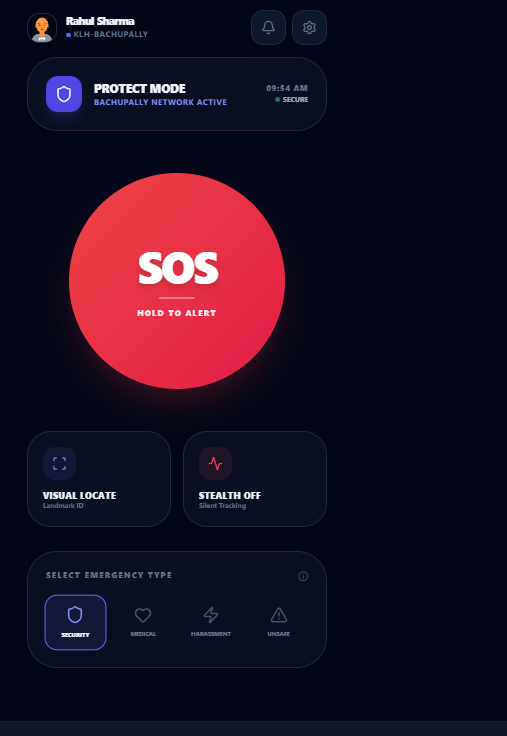
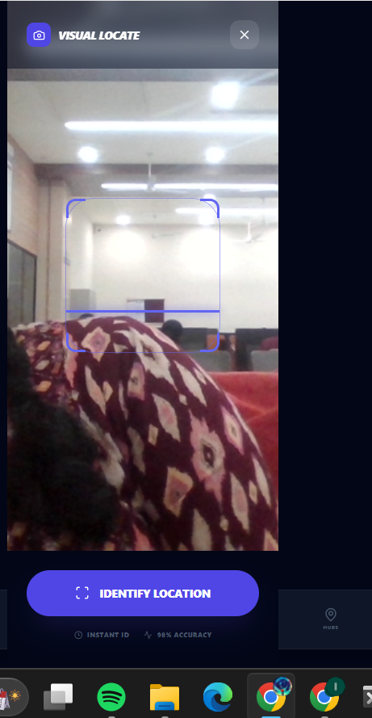
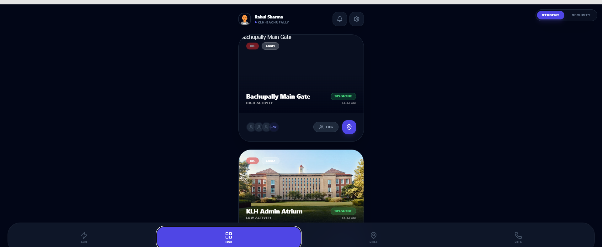
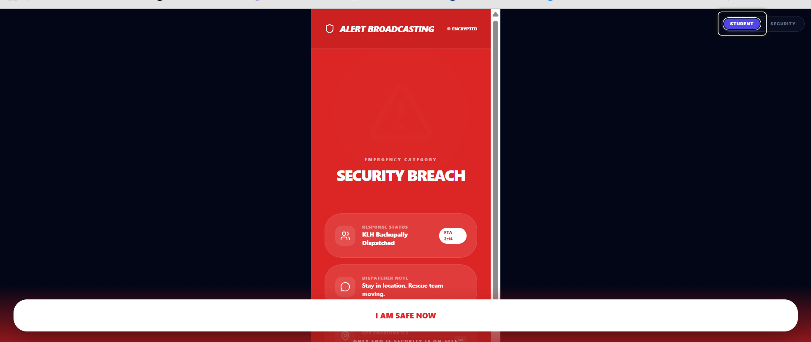

# 🚨 HYDERSAFE – Campus Emergency Response System

HyderSafe is a **real-time campus safety and emergency response platform** designed to help students instantly alert campus security during emergencies and enable security teams to respond faster with live monitoring and incident management.

---

## 🌐 Live Demo
🔗 **https://hydrasafe.netlify.app/**

---

## 🎯 Problem Statement
During campus emergencies, delayed communication and lack of real-time visibility can put lives at risk.  
HyderSafe bridges this gap by providing an **instant SOS system**, **live incident feed**, and **security coordination dashboard**.

---

## 🚀 Key Features

### 👨‍🎓 Student Interface
- One-tap **SOS emergency alert**
- Emergency category selection (Security, Medical, Harassment, Unsafe)
- Visual location identification
- Live response status
- “I Am Safe Now” confirmation

### 🛡️ Security Dashboard
- Live incident monitoring
- Real-time alert feed
- Incident location mapping
- Guard assignment & resolution
- Incident history & analytics

### ☁️ Backend
- Firebase Realtime Database
- Live data sync across users
- Secure and scalable architecture

---

## 🖼️ Screenshots

### 🔴 SOS Alert Interface

### 📍 Visual Location Detection

### 📡 Live Campus Monitor

### 🚨 Security Incident Feed

### 📢 Alert Broadcasting

---

## 🛠
